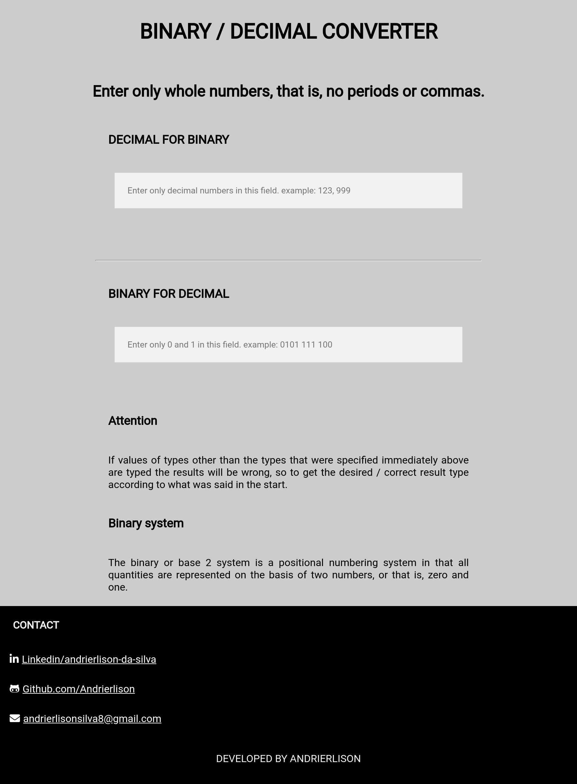

<h1 align="center">
    <a href="https://andrierlison.github.io/binary-decimal-converter">🔗Decimal Binary Converter</a>
</h1>

<p>With just a few clicks you can convert any integer decimal number to binary and binary to decimal as well.</p>
<p>I looked for inspiration in the [app-ideas] repository (https://github.com/florinpop17/app-ideas) There I found this challenge right away and became interested in it so I developed it quickly.</p>
<p>Very simple project with little javascript that fulfills its objective, with a very simplistic interface facilitates the use for those who are accessing it.</p>

<p align="center">
    <a href="#technologies">Technologies</a> •
    <a href="#license">License</a> •
    <a href="#author">Author</a>
</p>

<h2 align="center">Completed project</h2>

<p align="center">
    
</p>

<h1 id="technologies">The following tools were used in the construction of the project:</h1>

- [Html](https://developer.mozilla.org/pt-BR/docs/Web/HTML)
- [Css](https://developer.mozilla.org/pt-BR/docs/Web/Css)
- [Javascript](https://developer.mozilla.org/pt-BR/docs/Web/Javascript)

<h1>Copy</h1>
<p>You can feel free to copy the page</p>

<p>Before you begin, you will need to have the following tools installed on your machine</p>
<a href="https://git-scm.com">Git</a>
<p>In addition, it is good to have an editor to work with the code as <a href="https://code.visualstudio.com/">VSCode</a></p>

<h1>Clone this repository</h1>

```
$ git clone https://github.com/Andrierlison/binary-decimal-converter

# Access the project folder in the / cmd terminal

$ cd binary-decimal-converter
```

<h1 id="author">Author</h1>

<p>Andrierlison da Silva</p>
<a href="https://www.linkedin.com/in/andrierlison-da-silva-916775190/">🔗Linkedin</a>
<a href="https://github.com/Andrierlison">🔗Github</a>
<a href="mailto:andrierlisonsilva8@gmail.com"><i class="fas fa-envelope"></i>🔗andrierlisonsilva8@gmail.com</a>
